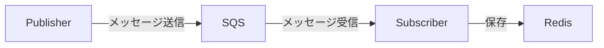

# Architecture

## アーキテクチャ



## ディレクトリ構成

外側のディレクトリはビルドコンテキスト（Dockerfile, pyproject.toml）、内側の同名ディレクトリが Python パッケージ本体です。
これは src layout の標準的な構成であり、`pip install .` 時にパッケージとして正しく認識されるために必要です。

```
src/
├── publisher/              # ビルドコンテキスト
│   ├── publisher/          # Python パッケージ
│   │   ├── config/         # インフラの初期化・設定
│   │   ├── domain/
│   │   │   ├── model/
│   │   │   │   └── message_definition/
│   │   │   └── service/
│   │   └── repository/
│   ├── Dockerfile
│   └── pyproject.toml
└── subscriber/
    ├── subscriber/
    │   ├── domain/
    │   │   ├── model/
    │   │   │   └── message_definition/
    │   │   └── service/
    │   └── repository/
    ├── Dockerfile
    └── pyproject.toml
```

## 設計方針

- publisher と subscriber は独立したパッケージとして実装する
- 非同期に動作する別プロセスであり、共通コードは持たない
- それぞれ個別にビルド・デプロイ可能とする
- Python パッケージの標準的な作法に従い、`pip install .` でインストール可能な構成とする
- Python のパッケージ構成には大きく src layout と flat layout があるが、本プロジェクトでは [Python 公式が推奨する src layout](https://packaging.python.org/ja/latest/discussions/src-layout-vs-flat-layout/) を採用している
  - 参考: [Pythonのsrc layoutとflat layout](https://nsakki55.hatenablog.com/entry/2024/10/28/095509)

## インフラ構成

- SQS (LocalStack) — publisher と subscriber 間のメッセージキュー
- Redis — subscriber が受信したメッセージの保存先
