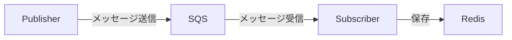

# Architecture

## アーキテクチャ



## ディレクトリ構成

```
src/
├── publisher/
│   ├── domain/
│   │   └── model/
│   │       └── message_definition/
│   └── repository/
└── subscriber/
    ├── domain/
    │   └── model/
    │       └── message_definition/
    └── repository/
```

## 設計方針

- publisher と subscriber は独立したパッケージとして実装する
- 非同期に動作する別プロセスであり、共通コードは持たない
- それぞれ個別にビルド・デプロイ可能とする

## インフラ構成

- SQS (LocalStack) — publisher と subscriber 間のメッセージキュー
- Redis — subscriber が受信したメッセージの保存先